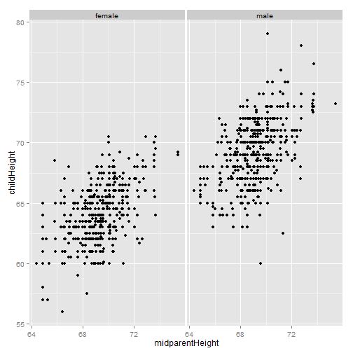

Study about the relationship between parents' height and children's height
========================================================
author: Huynh xuan phung
date: 

Overview
========================================================

- Loading dataset

```r
library(HistData)
data(GaltonFamilies)
```
- Summary data

```r
#summary(GaltonFamilies)
#head(GaltonFamilies)
names(GaltonFamilies)
```

```
[1] "family"          "father"          "mother"          "midparentHeight"
[5] "children"        "childNum"        "gender"          "childHeight"    
```

Plotting a graph that depict the correlation
========================================================


```r
library(ggplot2)
qplot(x = midparentHeight, y = childHeight, data = GaltonFamilies) +
  facet_wrap(~gender)
```

 

The relationship
========================================================
- Graph demonstrated the positive correlation between  midparentHeight (father + 1.8 * mother) and childHeight based on gender
- Correlation test

```

	Pearson's product-moment correlation

data:  GaltonFamilies$midparentHeight and GaltonFamilies$childHeight
t = 10.35, df = 932, p-value < 2.2e-16
alternative hypothesis: true correlation is not equal to 0
95 percent confidence interval:
 0.2622 0.3773
sample estimates:
   cor 
0.3209 
```

Providing predict model
========================================================
- We need more variables to predict childHeight exactly
- We don't need family and midParentHeight variable
- caret package is used to make model

```r
GaltonFamilies <- GaltonFamilies[,-c(1,4)]
library(caret)
set.seed(123)
inTrain <- createDataPartition(y=GaltonFamilies$childHeight,p=0.85, list=FALSE)
training <- GaltonFamilies[inTrain,]
testing <- GaltonFamilies[-inTrain,]
#modFit <- train(childHeight ~ ., data= training, method = "rf", prox=TRUE)
```

